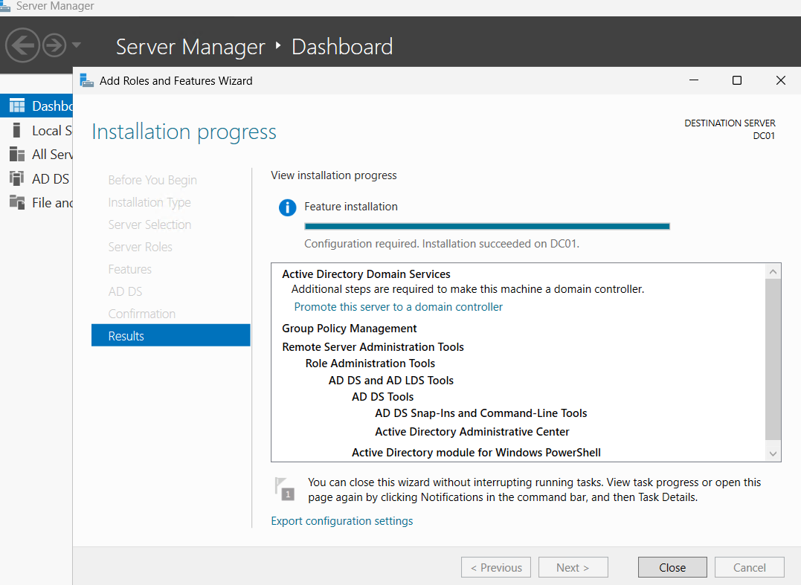
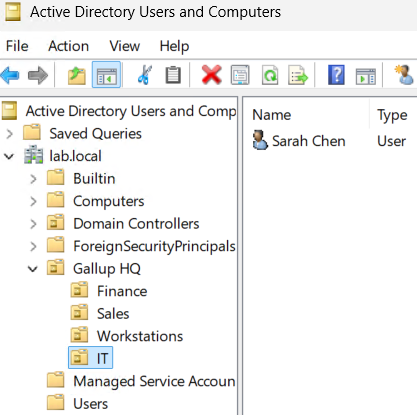
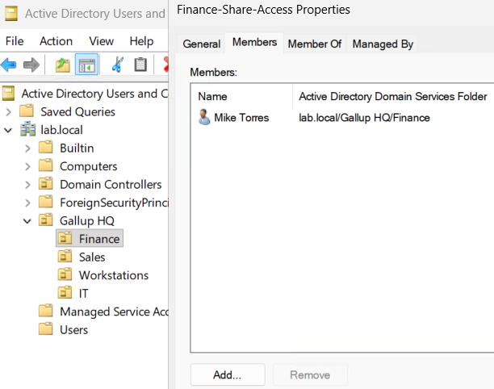
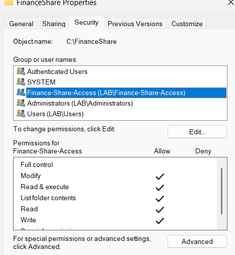
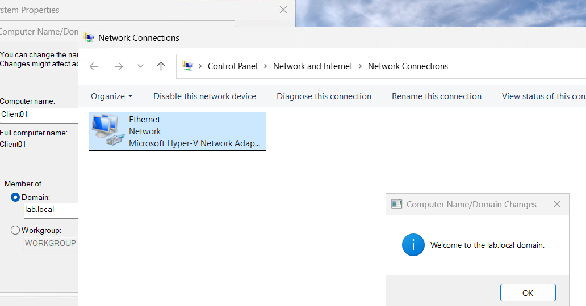
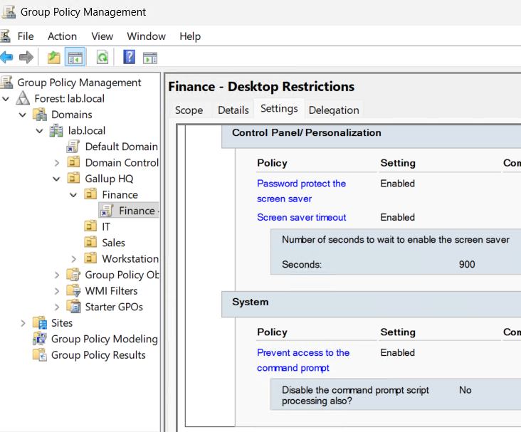
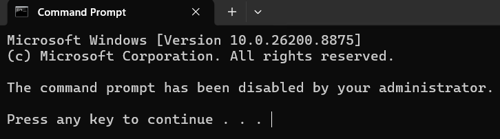

# Lab 01 — Active Directory Domain Services

## Objective
Build a Windows domain from scratch and configure the identity, access, and
policy layers that a help desk technician works with daily.

## Environment
Windows Server 2025 (DC01) promoted to domain controller for the `lab.local`
forest, with a Windows 11 client (Client01) joined to the domain. Hosted in Azure.

## What I built
- Installed AD DS and promoted DC01 to a domain controller, creating the
  `lab.local` forest with integrated DNS
- Designed an OU hierarchy mirroring a real org chart:
  `lab.local → Gallup HQ → IT / Finance / Sales / Workstations`
- Created domain users in their department OUs, each set to change password at
  first logon
- Created the `Finance-Share-Access` global security group and granted folder
  permissions to the group rather than to individual users
- Built a Group Policy Object (`Finance - Desktop Restrictions`) scoped to the
  Finance OU, enforcing a password-protected screen saver with a 900-second
  timeout and blocking command prompt access
- Joined Client01 to the domain and verified the GPO applied to a real user session
- Configured NTFS permissions on a shared folder, granted through the security group

## Problem hit
The GPO existed and appeared correctly linked, but a policy existing is not the
same as a policy applying. Verification required logging into the domain-joined
client as a Finance user and confirming enforcement at the endpoint — where the
command prompt returned "The command prompt has been disabled by your
administrator."

## What I learned
Access is granted to groups, never to individuals — when someone joins a
department, they join the group and every permission follows automatically.
OUs are containers for delegation and policy targeting, not security principals.
And a domain with no clients is a server talking to itself; the domain join is
what makes the whole structure real.

## Screenshots

*AD DS role installed on DC01, pending promotion to domain controller*

*OU hierarchy under Gallup HQ with users placed in department OUs*

*Finance-Share-Access security group with member*

*Share permissions granted to the security group, not the individual*

*Client01 successfully joined to lab.local*

*Desktop restrictions GPO scoped to the Finance OU*

*The policy enforced on the client — command prompt blocked*
