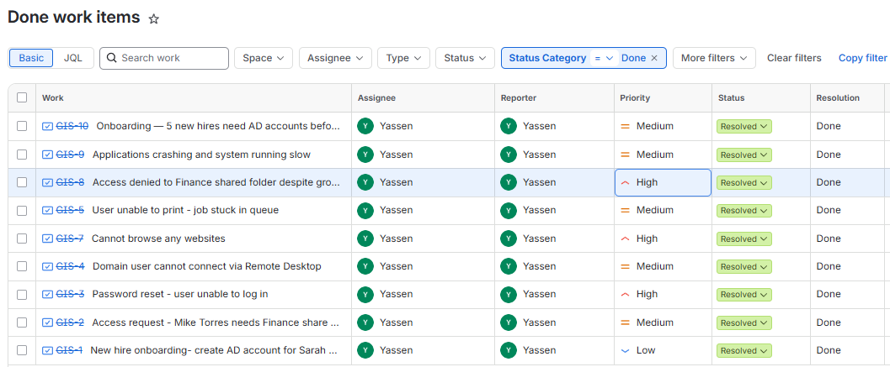

# Lab 02 — Service Desk Ticketing

## Objective
Document lab work the way a real service desk does, using the ticket structure
and prioritization a technician is expected to follow.

## Environment
Jira Service Management, configured as a single-queue IT service desk.

## What I built
Nine tickets covering the work across all five labs — account provisioning,
access requests, password resets, RDP failures, print issues, permissions
problems, system instability, DNS failure, and bulk onboarding.

Each ticket follows real service desk structure:
- **Description** — the user's reported symptom, in their own words
- **Comments** — the technician's diagnosis and resolution steps
- **Priority** — set by business impact, not by how interesting the problem is

## Approach to prioritization
A user fully blocked from working (no browsing, no access to their department
share) is High. Something degraded but workable (a stuck print job, a slow
machine) is Medium. Scheduled work with a deadline that isn't today, like
onboarding for next Monday, is Medium. A single routine account request is Low.

## What I learned
Writing the symptom separately from the diagnosis forces a discipline that
matters: what the user reported and what actually turned out to be wrong are
often different things, and conflating them in one field hides the reasoning.
The next technician who picks up a similar ticket needs both.

## Note
Tickets were self-authored in a personal lab environment to practice service
desk documentation. Scenarios are based on common tier-1 issues; the reporter
and assignee fields reflect a single-operator lab.

## Screenshot

*Nine resolved tickets with priorities set by impact*
