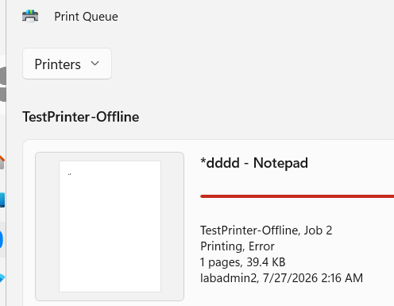
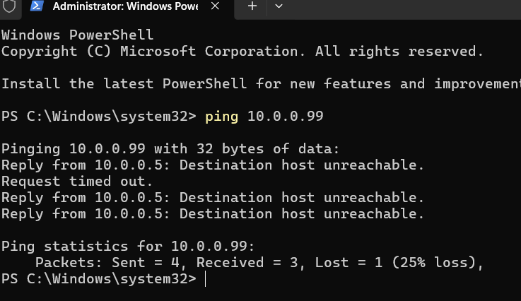
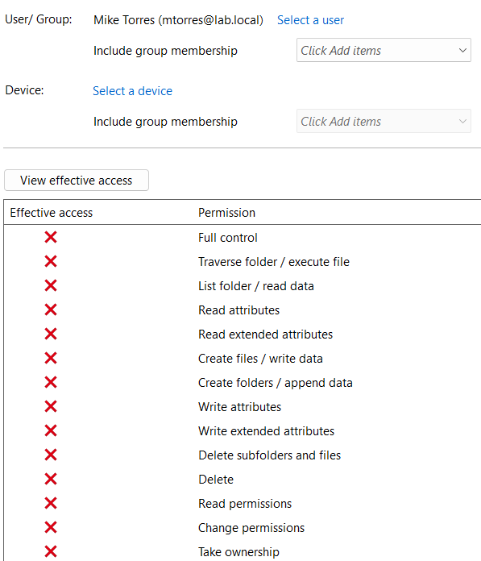
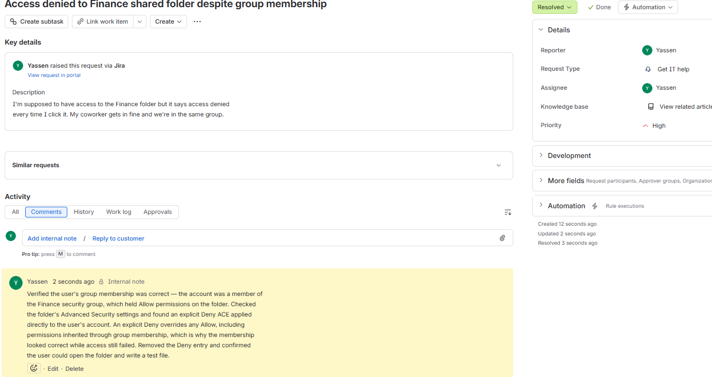
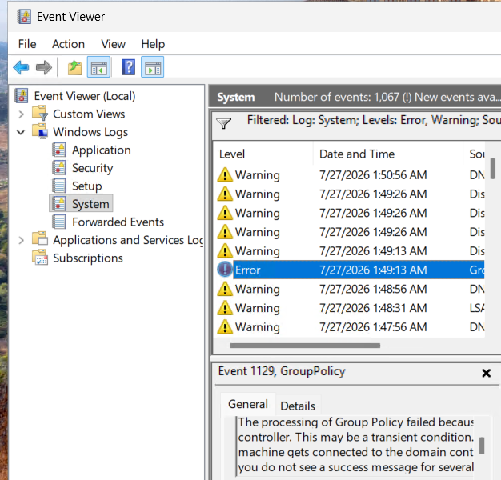
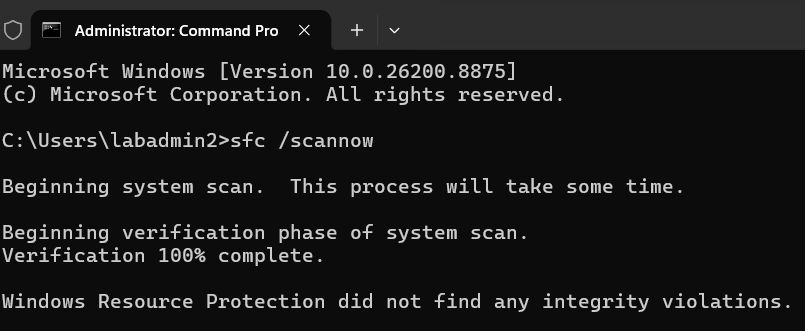

# Lab 03 — Windows Troubleshooting

## Objective
Diagnose common Windows endpoint failures using a structured approach — scope
the problem, gather evidence, isolate the cause, then fix it.

## Environment
Windows 11 domain-joined client and Windows Server 2025 domain controller.

## Scenario 1 — Print job stuck in queue
Confirmed the job was stalled with "Printing, Error" status. Rather than
assuming a driver or spooler fault, pinged the printer's IP address — the
request timed out, proving the device itself was unreachable. That ruled out
the software path entirely and pointed to the device being offline or
misconfigured. Cleared the queue and restarted the Print Spooler service.

**Root cause:** printer offline or incorrect IP configured. The next step in a
real environment would be verifying device power and network connectivity on site.

## Scenario 2 — Access denied despite correct group membership
A user reported being unable to open the Finance share while a colleague in the
same group had no trouble. Verified the group membership was correct and the
group held Allow permissions on the folder.

Used the **Effective Access** tab in Advanced Security to compute what the
user's permissions actually resolved to after all Allow and Deny entries
combined. Every single permission returned denied — because an explicit **Deny
ACE** had been applied directly to the user account, and an explicit Deny
overrides any Allow, including permissions inherited through a group.

That is exactly why the membership looked correct while access still failed.

## Scenario 3 — Applications crashing, system slow
Reviewed Event Viewer, filtering the System log for Error and Critical events
to identify a pattern rather than guessing. Checked Task Manager for resource
exhaustion. Ran `sfc /scannow` to verify the integrity of protected system
files — Windows Resource Protection found **no integrity violations**, which
ruled out system file corruption as a cause.

A clean scan is a real diagnostic result, not a failed one. It eliminates a
hypothesis and narrows what's left.

## What I learned
The Effective Access tab exists precisely because permissions resolve in ways
that aren't obvious from reading an ACL. And pinging the printer before
touching the spooler saved time that would otherwise have gone into
reinstalling a driver that was never the problem — scope first, then act.

## Screenshots

*Print job stalled in error state*

*Ping to the printer IP times out — the device, not the spooler*

*Effective Access shows every permission denied despite group membership*

*The ticket documenting the Deny ACE diagnosis*

*System log filtered to Error and Critical events*

*System file integrity verified — no violations found*
