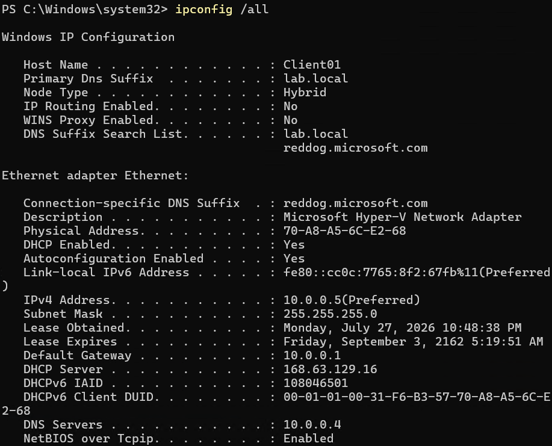
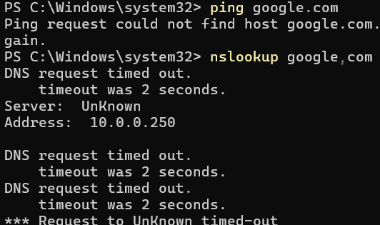
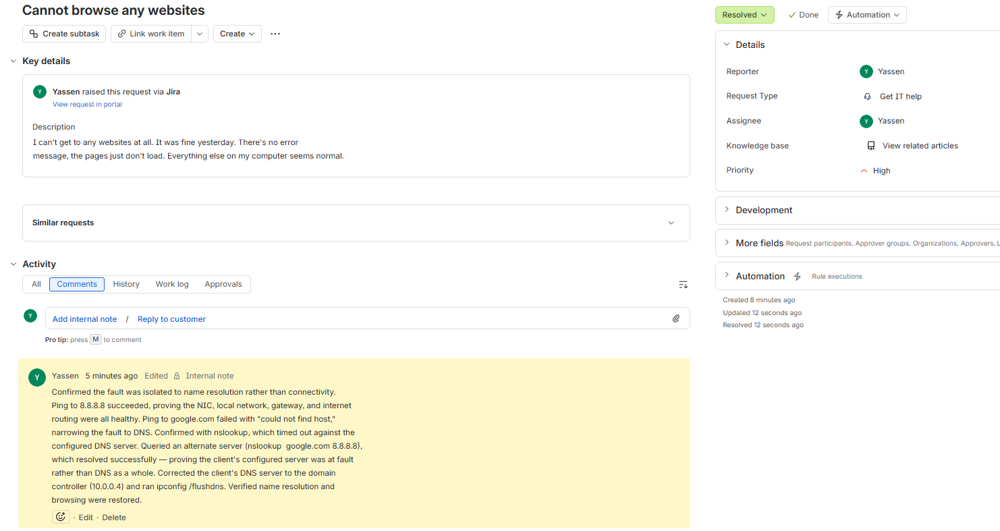

# Lab 04 — Network Troubleshooting

## Objective
Diagnose a simulated loss of internet access on a domain-joined client using
structured, evidence-based testing rather than guessing.

## Environment
Windows 11 client (10.0.0.5) on `lab.local`, DNS served by the domain
controller at 10.0.0.4. Hosted in Azure.

## Baseline first
Captured `ipconfig /all` on a healthy machine before changing anything —
IP 10.0.0.5, /24 subnet mask, gateway 10.0.0.1, DNS 10.0.0.4, primary DNS
suffix `lab.local` confirming domain membership.

You cannot recognize a broken configuration if you've never looked at a working one.

## The fault
Simulated a DNS failure by pointing the client at an unreachable resolver, then
diagnosed it as a technician would receiving the ticket cold.

## Diagnosis
`ping 8.8.8.8` succeeded. `ping google.com` failed with "could not find host."

That single contrast eliminated the NIC, the local network, the gateway, and
internet routing in one step — packets were reaching the internet fine, so the
only remaining candidate was name resolution.

Confirmed with `nslookup`, which timed out against the configured server and
returned "Server: UnKnown" — the client couldn't even reverse-resolve the
resolver it had been told to use. Then queried an alternate server
(`nslookup google.com 8.8.8.8`), which resolved successfully.

That last step is what turned "DNS is broken" into "*this specific server* is
broken" — the difference between a guess and a diagnosis.

## Resolution
Corrected the client's DNS server to the domain controller (10.0.0.4), ran
`ipconfig /flushdns`, and verified both name resolution and browsing were restored.

## The connectivity ladder
Each rung isolates one layer:

| Test | What it proves |
|------|----------------|
| `ping 127.0.0.1` | The TCP/IP stack is functioning |
| `ping <own IP>` | The NIC is functioning |
| `ping <gateway>` | The local network is reachable |
| `ping 8.8.8.8` | Routing to the internet works |
| `ping google.com` | DNS resolution works |

## Cloud vs. on-prem finding
An attempt to sabotage the route table on the guest OS had no effect — Azure
enforces routing at the platform layer through route tables and NSGs, which
override changes made inside the VM. Worth knowing before troubleshooting a
cloud-hosted machine as though it were sitting in a server room.

## Screenshots

*Healthy configuration captured before introducing any fault*

*Name resolution fails while IP connectivity works — the DNS signature*

*The ticket as filed and resolved*
