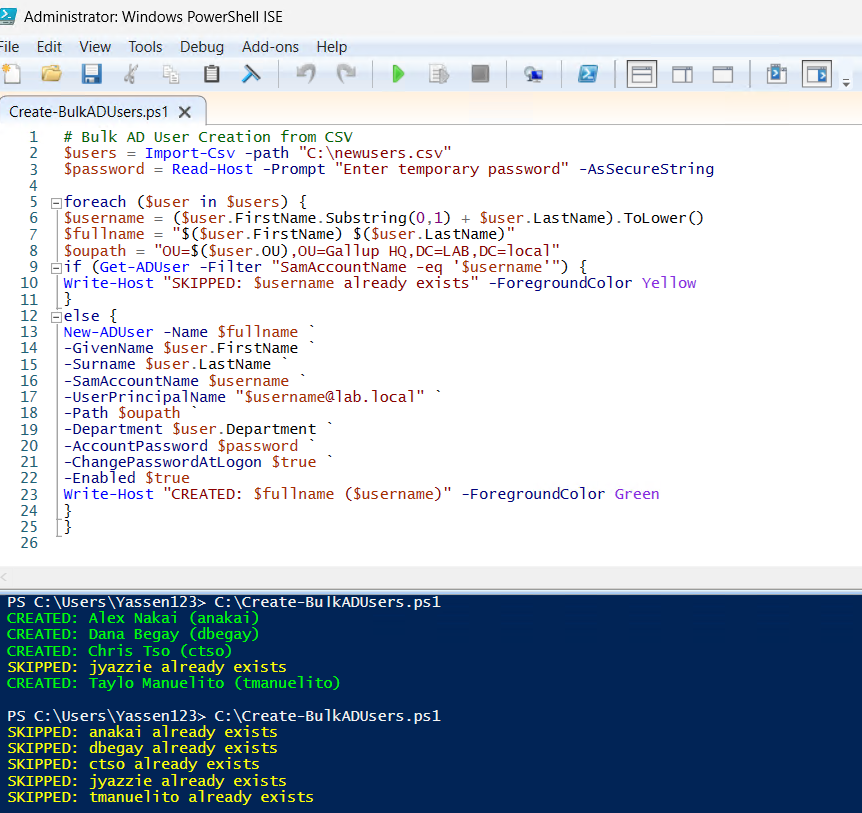
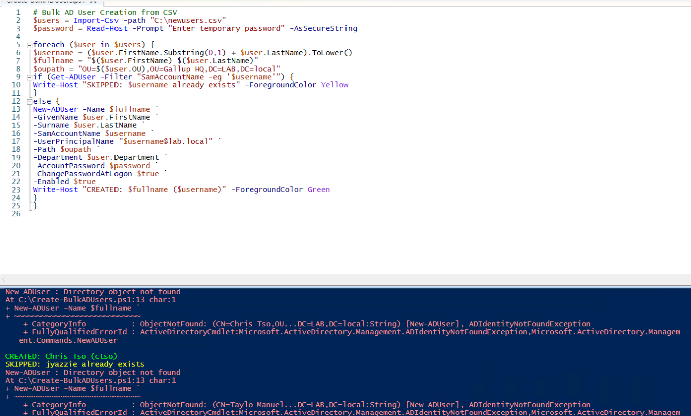
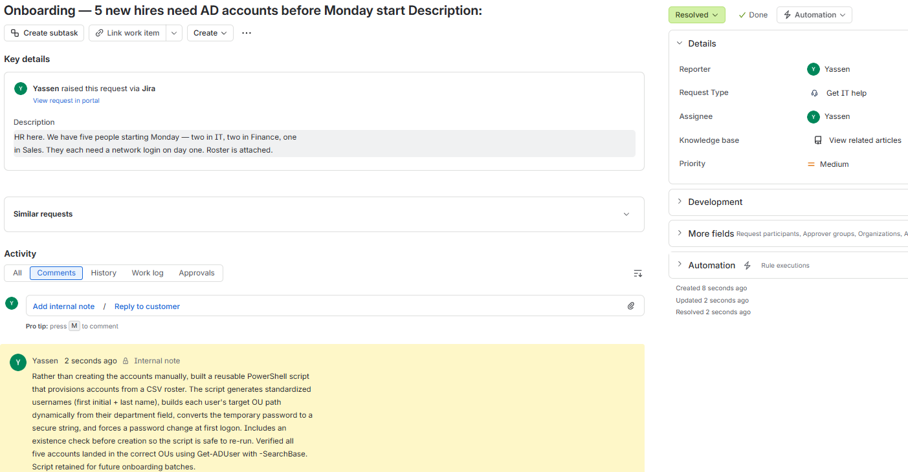

# Lab 05 — PowerShell Bulk AD Provisioning

## Objective
Replace a repetitive manual process — creating accounts one at a time in ADUC —
with a reusable, re-runnable script driven by a CSV roster.

## Environment
Windows Server 2025 domain controller, PowerShell ISE, ActiveDirectory module.

## The scenario
HR submits a roster of five new hires starting Monday across IT, Finance, and
Sales. Each needs a domain account in the correct OU before day one.

## What the script does
- Imports a CSV roster, turning each row into an object
- Generates a standardized username — first initial + last name, lowercased
- Builds each user's target OU distinguished name **dynamically** from their
  department field, so one script serves every department
- Prompts for the temporary password at runtime and converts it to a secure
  string — no credential is ever stored in the file
- Checks whether the account already exists before attempting creation, making
  the script **idempotent** and safe to re-run
- Forces a password change at first logon

## Proving it's safe to re-run
Running the script twice is the real test. The first run created four accounts
and skipped one — a user who already existed from a previous lab, caught by the
duplicate check on a genuine collision. The second run skipped all five.

A script that errors out on its second execution isn't production-usable.

## Error handling under test
Deliberately pointed one CSV row at a nonexistent OU. The script threw
`Directory object not found` naming the exact user and line number, **and
continued processing the remaining rows** — one bad record in the roster
doesn't stop the other four accounts from being created.

## Bugs I hit building it
The first version had five, and one is worth calling out: I used `+` instead of
`=` on a string assignment. That's valid PowerShell syntax, so it threw **no
error** — it evaluated the expression and discarded the result, leaving the
variable empty. Every account would have been created with a blank display name.

The lesson stuck: no error does not mean correct. Verify actual output, not
just whether something ran.

## Files
- [`Create-BulkADUsers.ps1`](./Create-BulkADUsers.ps1) — the script
- [`newusers-sample.csv`](./newusers-sample.csv) — expected input format

## Screenshots

*Two consecutive runs — creation, then all skipped, proving idempotency*

*A bad OU path fails cleanly by name and line number without halting the run*

*The onboarding request that drove the automation*
